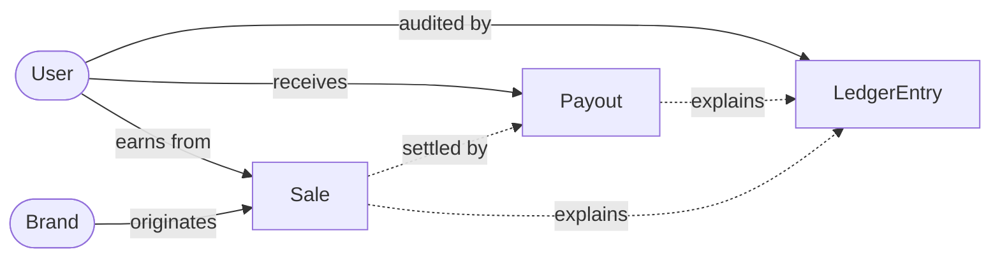
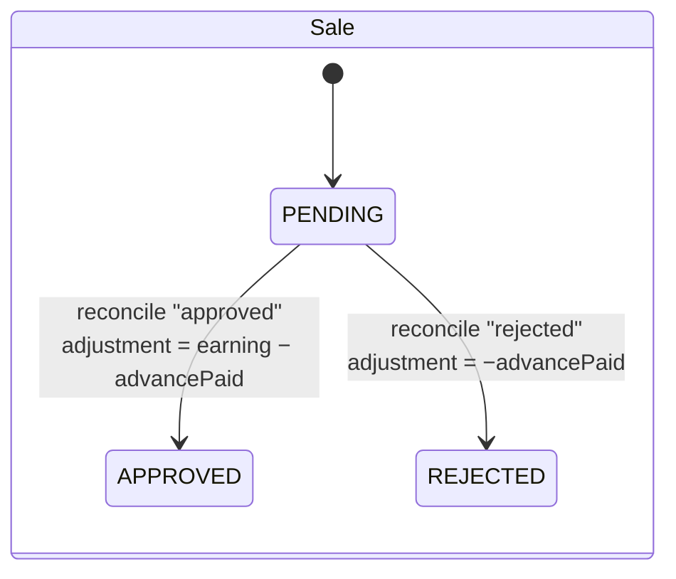
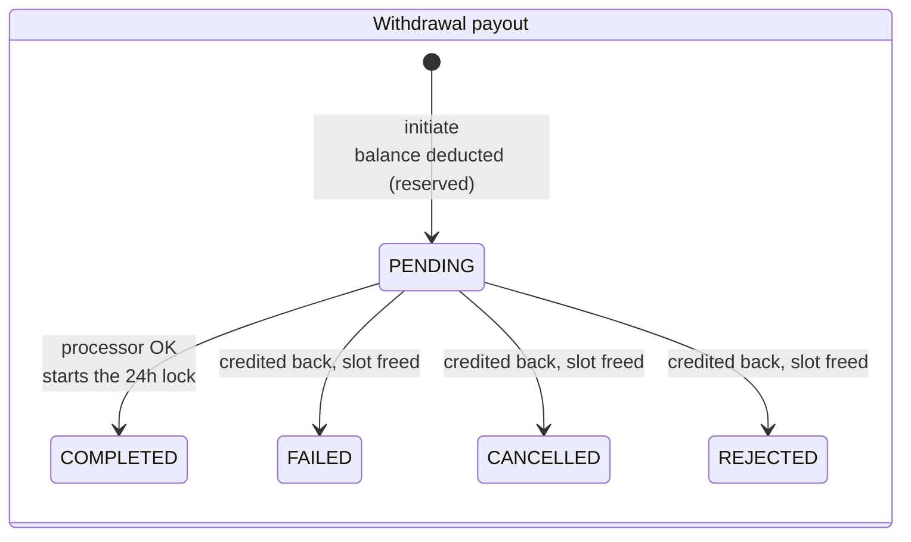

# User Payout Management System

A low-level design + working implementation of an affiliate-sales payout system.

Every sale enters as **PENDING** and is eligible for an **advance payout of 10%** of its earnings. An admin later **reconciles** each sale to **APPROVED** (pay the remainder: `earning − advance`) or **REJECTED** (claw the advance back: `−advance`). Users **withdraw** their accumulated balance — at most **one successful withdrawal every 24 hours** — and if a withdrawal later **fails / is cancelled / is rejected**, the money is credited back and the user may immediately try again.

**Stack:** Bun · TypeScript · Express 5 · Prisma 7 · PostgreSQL

> ✅ The assignment's worked example (3 pending sales × ₹40) reproduces exactly: **₹12 total advance, ₹68 total final payout** — proven by a named automated test and by `bun run demo`.

---

## Quick start

Prerequisites: [Bun](https://bun.sh) ≥ 1.2 and a PostgreSQL database (any provider — a hosted Neon/Supabase instance, a local install, or `docker compose up -d` using the included [docker-compose.yml](docker-compose.yml)).

```bash
bun install
cp .env.example .env            # then set DATABASE_URL
bunx prisma migrate dev         # creates schema + generates the client
bun run seed                    # loads the assignment's exact reference data
bun run dev                     # serves http://localhost:3000
```

**See it work (the fastest path for an evaluator):**

```bash
bun run demo    # runs the entire worked example over HTTP and prints ₹68
bun test        # 37 tests: money math, business rules, concurrency, HTTP
```

> Note: for a Neon database, use the **direct** (non-pooled) connection string so `prisma migrate` works. Tests and the demo **wipe and reseed** the database they point at — use a throwaway DB.

---

## Low-level design

### Entity–relationship model



| Entity | Key fields | Notes |
| --- | --- | --- |
| **User** | `id` PK, `username` UK, `withdrawableBalance`, `lastSuccessfulWithdrawalAt` | Balance is denormalized for O(1) reads; the timestamp drives the 24h gate |
| **Brand** | `id` PK, `name` UK | |
| **Sale** | `id` PK, `earning`, `status` (PENDING\|APPROVED\|REJECTED), `advancePaid`, `advancePaidAt`, `reconciledAt` | `advancePaidAt` is the idempotency guard for the advance job |
| **Payout** | `id` PK, `type` (ADVANCE\|FINAL_ADJUSTMENT\|WITHDRAWAL), `amount` (negative allowed), `status` (PENDING\|COMPLETED\|FAILED\|CANCELLED\|REJECTED) | |
| **LedgerEntry** | `id` PK, `amount` (signed delta), `reason`, `balanceAfter` | Append-only; `balanceAfter` lets the balance be verified by replay |

Full schema with indexes: [prisma/schema.prisma](prisma/schema.prisma).

### State machines





Terminal states are final: reconciling a non-PENDING sale or resolving a non-PENDING payout returns **409**.

### Module design

Routes are thin (parse → validate → call service → shape response); every business rule lives in a service; **only the ledger service mutates the balance**.

| Module | Responsibility |
| --- | --- |
| [src/services/ledgerService.ts](src/services/ledgerService.ts) | `applyLedgerEntry(tx, …)` — the **single** place `withdrawableBalance` changes; appends the immutable audit row with `balanceAfter`, atomically, inside the caller's transaction |
| [src/services/advancePayoutService.ts](src/services/advancePayoutService.ts) | `runAdvancePayoutJob(username?)` — pays the one-time 10% advance per pending sale, one row-locked transaction per sale |
| [src/services/reconciliationService.ts](src/services/reconciliationService.ts) | `reconcileSale(saleId, "approved"\|"rejected")` — computes and books the final adjustment |
| [src/services/withdrawalService.ts](src/services/withdrawalService.ts) | `initiateWithdrawal` (guards → reserve) and `resolveWithdrawal` (complete, or credit back) |
| [src/services/salesService.ts](src/services/salesService.ts) / [userService.ts](src/services/userService.ts) | Sale intake (upserts user + brand by name, as in the reference schema) and user reads |
| [src/money.ts](src/money.ts) | All money math on `Prisma.Decimal` — JS `number` is never used for money |
| [src/errors.ts](src/errors.ts) | `AppError(status, code, message)` + the middleware mapping it to the error envelope |
| [src/routes/](src/routes/) · [src/app.ts](src/app.ts) | Express wiring, zod validation, app factory (`buildApp()`) reused by tests and the demo |

### Money movement (double-entry-style ledger)

`User.withdrawableBalance` is a denormalized running total for O(1) balance checks. Every change writes a `LedgerEntry` (signed delta + `balanceAfter`) in the same transaction, so at any moment:

```
withdrawableBalance === Σ LedgerEntry.amount        (verified by tests after every flow)
```

The worked example's trail, as printed by `bun run demo`:

```
ADVANCE_PAYOUT       +4   → 4        FINAL_ADJUSTMENT    −4   → 8
ADVANCE_PAYOUT       +4   → 8        FINAL_ADJUSTMENT   +36   → 44
ADVANCE_PAYOUT       +4   → 12       FINAL_ADJUSTMENT   +36   → 80
```

---

## API reference

| Method | Path | Body | Purpose |
| --- | --- | --- | --- |
| POST | `/api/sales` | `{ userId, brand, earning }` | Record a pending sale (mirrors the reference schema) |
| GET | `/api/users/:username/sales?status=` | — | List a user's sales, optionally by status |
| POST | `/api/jobs/advance-payout` | `{ userId? }` | Run the advance-payout job (all users, or one) |
| POST | `/api/admin/sales/:saleId/reconcile` | `{ status: "approved" \| "rejected" }` | Reconcile one sale |
| GET | `/api/users/:username/balance` | — | Current withdrawable balance |
| POST | `/api/users/:username/withdraw` | `{ amount }` | Initiate a withdrawal (24h-gated) |
| POST | `/api/payouts/:payoutId/resolve` | `{ status: "completed" \| "failed" \| "cancelled" \| "rejected" }` | Resolve an in-flight withdrawal (simulates the processor webhook) |
| GET | `/api/users/:username/ledger` | — | Full audit trail |

Errors always use one envelope: `{ "error": { "code", "message", "details?" } }`. A 429 additionally sets a `Retry-After` header. Money in JSON: entity rows serialize `Decimal` values natively (`"40"`), computed summaries (`balance`, `adjustment`, `totalAdvancePaid`) are fixed 2-decimal strings (`"80.00"`).

### Curl walkthrough (the worked example)

```bash
# 1. Three pending sales, ₹40 each
for i in 1 2 3; do
  curl -s -X POST localhost:3000/api/sales -H 'Content-Type: application/json' \
       -d '{"userId":"john_doe","brand":"brand_1","earning":40}'
done

# 2. Advance payout job → {"salesProcessed":3,"totalAdvancePaid":"12.00"}
curl -s -X POST localhost:3000/api/jobs/advance-payout

# 3. Reconcile (grab ids from the sales list): one rejected, two approved
curl -s localhost:3000/api/users/john_doe/sales
curl -s -X POST localhost:3000/api/admin/sales/<SALE_ID>/reconcile \
     -H 'Content-Type: application/json' -d '{"status":"rejected"}'   # → "adjustment":"-4.00"
# …repeat with {"status":"approved"} for the other two               # → "adjustment":"36.00" each
# Total final payout: −4 + 36 + 36 = ₹68 ✓

# 4. Balance = 12 + 68 → {"withdrawableBalance":"80.00"}
curl -s localhost:3000/api/users/john_doe/balance

# 5. Withdraw, fail it, retry (Question 2)
curl -s -X POST localhost:3000/api/users/john_doe/withdraw \
     -H 'Content-Type: application/json' -d '{"amount":50}'           # → PENDING payout, balance 30.00
curl -s -X POST localhost:3000/api/payouts/<PAYOUT_ID>/resolve \
     -H 'Content-Type: application/json' -d '{"status":"failed"}'     # → balance back to 80.00
curl -s -X POST localhost:3000/api/users/john_doe/withdraw \
     -H 'Content-Type: application/json' -d '{"amount":50}'           # → allowed immediately
```

---

## Edge cases & failure scenarios

| Scenario | Behavior | Proven by |
| --- | --- | --- |
| Advance job runs twice on the same sale | Second run is a no-op (`advancePaidAt` guard re-checked under a row lock) | `services.test.ts` "running the job twice…" |
| Two advance jobs race on the same sales | Each sale paid exactly once (`FOR UPDATE` serializes) | `concurrency.test.ts` "two advance jobs racing…" |
| Sale reconciled twice / two racing reconciliations | Exactly one wins; the rest get **409 ALREADY_RECONCILED** | `services.test.ts` + `concurrency.test.ts` |
| Sale rejected when no advance was ever paid | Adjustment is ₹0 — no payout or ledger noise | `services.test.ts` "…is a ₹0 no-op" |
| Withdrawal exceeding balance / non-positive / unknown user | **400 / 400 / 404**, no state change | `withdrawals.test.ts` |
| Second withdrawal while one is still PENDING | **409 WITHDRAWAL_IN_PROGRESS** (else two could complete inside 24h) | `withdrawals.test.ts` |
| Withdrawal inside 24h of the last successful one | **429 WITHDRAWAL_LIMIT** + `Retry-After`; failed attempts never consume the slot | `withdrawals.test.ts`, `api.test.ts` |
| Processor webhook delivered twice / two racing resolutions | Exactly one applies; the rest get **409 ALREADY_RESOLVED** | `withdrawals.test.ts` + `concurrency.test.ts` |
| Two racing withdrawal initiations | One wins; balance can never be double-spent | `concurrency.test.ts` |
| Advance withdrawn, then the sale is rejected | Balance goes negative (a debt); further withdrawals blocked until repaid by future payouts | `withdrawals.test.ts` "blocks withdrawals while balance ≤ 0" |
| Money precision | `Decimal(12,2)` end to end; 10% advance rounds half-up to 2dp | `money.test.ts` |
| Job crash mid-run | One transaction **per sale** — already-paid sales stay consistent; rerun finishes the rest | design (`advancePayoutService.ts`) |

---

## Key design decisions & trade-offs

1. **Ledger + denormalized balance.** An append-only `LedgerEntry` table is the source of truth (auditable, recomputable); `withdrawableBalance` is a cached total for hot-path reads. Tests assert the two never diverge. Trade-off: every money move writes two rows — the standard price of auditability in money systems.
2. **Idempotency via state guards inside row-locked transactions**, not idempotency keys. Each mutation locks the relevant row (`SELECT … FOR UPDATE`), re-checks the guard (`advancePaidAt IS NULL`, `status = PENDING`), then writes. Simpler than a key store and covers both retries and races; trade-off: retried *initiations* (as opposed to re-runs) create a new withdrawal rather than deduplicating — acceptable given the one-pending-withdrawal rule.
3. **Reserve-on-initiate withdrawals.** The balance is deducted when the withdrawal is created, not when it completes — the user can never spend money that is in flight. A failure credits it back via an explicit `WITHDRAWAL_REVERSED` entry, keeping the audit trail honest.
4. **24h lock counts only successful withdrawals** (`lastSuccessfulWithdrawalAt` is set exclusively on `completed`), which is what Question 2 requires — a failed payout must let the user "initiate another withdrawal".
5. **One pending withdrawal at a time.** The spec is silent; allowing several would let two complete inside one 24h window, so concurrent pendings are rejected with 409.
6. **Negative balances are allowed** (rejection after the advance was withdrawn). The debt is visible in the ledger and nets off against future earnings; withdrawals are blocked while ≤ 0. Alternative (blocking rejection or external recovery) felt heavier than the assignment warrants.
7. **Advance job as an endpoint, not a cron.** Deterministic to demo and test; in production it would be a scheduled worker calling the same service function.
8. **`Prisma.Decimal` everywhere; JS `number` never touches money.** Advance = 10% rounded half-up to 2 decimals (the worked example is exact: ₹4/sale).

## Known limitations (deliberate, given scope)

- No authentication/authorization — `/api/admin/*` and the job endpoint would need it in production.
- No pagination on list endpoints.
- The processor webhook is simulated by an endpoint; a real integration would verify signatures and handle out-of-order delivery (the 409 idempotency guard already covers replays).
- Per-sale advances are computed row-by-row; a set-based SQL job would scale better for millions of pending sales.

## Project layout & tests

```
prisma/schema.prisma   schema (5 models, 4 enums)      tests/money.test.ts        5 tests
prisma/seed.ts         exact reference data            tests/services.test.ts     8 tests (₹68 here)
src/services/          all business logic              tests/withdrawals.test.ts 14 tests
src/routes/ + app.ts   HTTP layer                      tests/api.test.ts          6 tests (₹68 over HTTP)
scripts/demo.ts        end-to-end proof (₹68)          tests/concurrency.test.ts  4 tests
```

Tests run against the real database in `DATABASE_URL` (wiping it each test) — business rules, race conditions and HTTP behavior are exercised for real, nothing is mocked.
